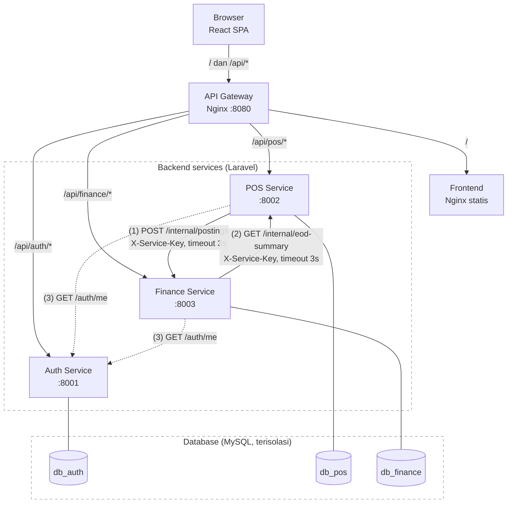
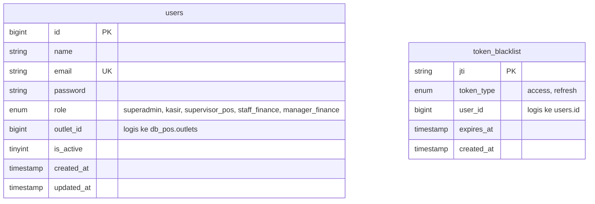
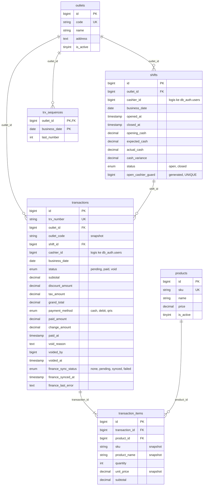
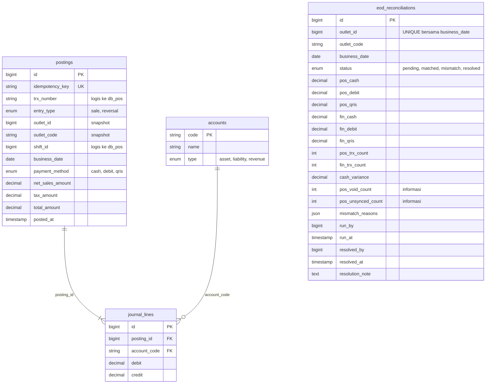

# POS + Finance — Microservice (Laravel 13 + React)

Dua sistem yang terintegrasi: **POS** (shift kasir, transaksi, pembayaran, void) dan **Finance** (posting jurnal double-entry, rekonsiliasi End of Day). Dibangun sebagai microservice dengan **database terpisah per service**, satu frontend **React SPA**, dan **Nginx** sebagai API Gateway. Seluruh stack berjalan dengan satu perintah `docker compose up`.

## Fitur Utama

- Autentikasi terpusat (**JWT access + refresh token**, rotasi refresh, blacklist logout) dengan 5 role: **superadmin, kasir, supervisor_pos, staff_finance, manager_finance**
- Manajemen shift kasir: buka shift, ringkasan realtime, tutup shift dengan perhitungan `expected_cash` dan `cash_variance`
- Transaksi penjualan (pending → paid / void) dengan harga, PPN, dan kembalian dihitung server
- Posting ke Finance **idempoten**; kegagalan Finance tidak pernah menggagalkan pembayaran (status `failed` + resync)
- Jurnal double-entry otomatis (sale dan reversal) yang selalu seimbang
- Rekonsiliasi End of Day POS vs ledger Finance, dengan alur resolve oleh manager
- Dashboard per role, route guard per role, auto-refresh token di frontend

## Teknologi

- Laravel 13 (PHP 8.4) untuk Auth, POS, dan Finance Service
- React 19 + Vite (satu SPA untuk semua modul)
- MySQL 8.4 (`db_auth`, `db_pos`, `db_finance`, terisolasi)
- Nginx (API Gateway) dan FrankenPHP (runtime PHP)
- Docker + Docker Compose v2
- PHPUnit untuk unit test, `curl` + `jq` untuk skenario E2E

## Menjalankan Project

Kebutuhan: Docker + Docker Compose v2.

```bash
# 1. Clone repository
git clone https://github.com/suadda/microservices-pos-finance.git
cd microservices-pos-finance

# 2. Jalankan seluruh stack (3 service + 3 MySQL + frontend + gateway)
docker compose up -d --build
```

Tidak ada secret di repo dan tidak perlu file `.env`. Service `secrets-init` berjalan paling awal dan membuat `APP_KEY` tiap service, `JWT_SECRET`, `INTERNAL_API_KEY`, serta password MySQL secara acak ke volume `secrets` (sekali, lalu dipakai ulang saat restart). Untuk memakai nilai sendiri, salin `.env.example` ke `.env` (di-gitignore) dan isi yang diperlukan.

Saat container start, migrasi dan seeder dijalankan otomatis (idempoten). Buka **http://localhost:8080** (SPA + API).

| Akses                     | Alamat / Perintah                                                        |
|---------------------------|--------------------------------------------------------------------------|
| Aplikasi (SPA + API)      | `http://localhost:8080`                                                  |
| Auth Service (langsung)   | `http://localhost:8001`                                                  |
| POS Service (langsung)    | `http://localhost:8002`                                                  |
| Finance Service (langsung)| `http://localhost:8003`                                                  |
| Service key (uji `/internal/*`) | `docker compose exec pos-service cat /run/secrets/internal_api_key` |
| Ganti port gateway        | `GATEWAY_PORT=9090 docker compose up -d`                                 |
| Reset data                | `docker compose down -v && docker compose up -d --build` (secret ikut dibuat ulang) |

Development frontend: `cd frontend && npm install && npm run dev` (proxy `/api` ke `localhost:8080`).

## Akun Login Testing

Semua akun memakai password: **`password123`**

| Role            | Email                                                                                                              | Outlet                 |
|-----------------|--------------------------------------------------------------------------------------------------------------------|------------------------|
| superadmin      | `superadmin@demo.test`                                                                                             | semua                  |
| staff_finance   | `staff.finance@demo.test`                                                                                          | semua                  |
| manager_finance | `manager.finance@demo.test`                                                                                        | semua                  |
| kasir           | `kasir.bdg@demo.test`, `kasir.grt@demo.test`, `kasir.skb@demo.test`, `kasir.tsm@demo.test`                         | BDG / GRT / SKB / TSM  |
| supervisor_pos  | `supervisor.bdg@demo.test`, `supervisor.grt@demo.test`, `supervisor.skb@demo.test`, `supervisor.tsm@demo.test`     | BDG / GRT / SKB / TSM  |

> Akun ini hanya untuk pengujian. Pada deployment yang bisa diakses publik, set `SEED_DEMO_USERS=false` di `.env`: akun demo yang sudah ada otomatis dinonaktifkan pada start berikutnya. Superadmin sendiri bisa dibuat dari `ADMIN_EMAIL` + `ADMIN_PASSWORD` (min. 12 karakter, dibuat sekali bila email belum ada).

### Data Seeder

| Data    | Isi                                                                                                                  |
|---------|----------------------------------------------------------------------------------------------------------------------|
| Outlet  | `1 BDG` Bandung, `2 GRT` Garut, `3 SKB` Sukabumi, `4 TSM` Tasikmalaya                                                |
| Produk  | bahan bangunan: `CAT-5KG` Cat Tembok 5 kg (100.000), `SMN-40KG` Semen 40 kg (50.000), `PIPA-PVC4` Pipa PVC 4" (200.000) untuk skenario S1, `PAKU-5CM`, `BESI-10`, `KRMK-4040`, `BATA-RGN`, `TRPK-9`, `PSR-KRG`, dan `OLD-001` (nonaktif) |
| Akun    | 1 akun per role (tabel di atas), kasir dan supervisor per outlet                                                     |
| Finance | Chart of accounts `1101`, `1102`, `1103`, `2101`, `4101`                                                             |

Rekonsiliasi bersifat satu baris per outlet per hari, sehingga disediakan 4 outlet agar skenario S1, S2, S3, dan S5 bisa diuji pada hari yang sama.

### Variabel Environment

Setiap service punya `.env.example` yang mendokumentasikan seluruh variabel. Variabel utama:

| Variabel                         | Service              | Keterangan                                                                      |
|----------------------------------|----------------------|---------------------------------------------------------------------------------|
| `JWT_SECRET`                     | Auth                 | Secret HS256 (min. 32 karakter); hanya Auth Service yang mengetahuinya          |
| `JWT_ACCESS_TTL`, `JWT_REFRESH_TTL` | Auth              | Masa berlaku token dalam detik (default `900` dan `604800`)                     |
| `TAX_RATE`                       | POS                  | Tarif PPN (default `0.11`)                                                      |
| `INTERNAL_API_KEY`               | POS, Finance         | Secret untuk `/internal/*` (header `X-Service-Key`); harus sama di keduanya      |
| `AUTH_SERVICE_URL`, `POS_SERVICE_URL`, `FINANCE_SERVICE_URL` | POS, Finance | URL antar service di jaringan Docker                       |
| `SERVICE_HTTP_TIMEOUT`           | POS, Finance         | Timeout panggilan antar service dalam detik (default `3`)                       |
| `SEED_DEMO_USERS`, `ADMIN_EMAIL`, `ADMIN_PASSWORD` | Auth | Pengaturan akun demo dan superadmin awal                                   |
| `VITE_REFRESH_LEEWAY`            | Frontend             | Detik sebelum token kedaluwarsa saat auto-refresh dijalankan (default `60`)     |

## Arsitektur



### Komunikasi Antar Service

| Dari            | Ke              | Tujuan                                                              |
|-----------------|-----------------|---------------------------------------------------------------------|
| POS Service     | Auth Service    | Validasi JWT di setiap request masuk (`GET /auth/me`)               |
| Finance Service | Auth Service    | Validasi JWT di setiap request masuk (`GET /auth/me`)               |
| POS Service     | Finance Service | Posting transaksi paid dan reversal void (`POST /internal/postings`) |
| Finance Service | POS Service     | Tarik ringkasan EOD saat rekonsiliasi (`GET /internal/eod-summary`)  |
| React Frontend  | Auth Service    | Login, logout, refresh token                                        |
| React Frontend  | POS Service     | Produk, shift, transaksi                                            |
| React Frontend  | Finance Service | Posting, jurnal, rekonsiliasi                                       |

Aturan komunikasi:
- Seluruh komunikasi antar service **HTTP REST sinkron**, tanpa message broker, timeout 3 detik (`SERVICE_HTTP_TIMEOUT`).
- `/internal/*` hanya menerima header `X-Service-Key` = `INTERNAL_API_KEY` (dibandingkan dengan `hash_equals`) dan **diblokir di gateway** (404). Gateway juga menghapus header `X-Service-Key` dari klien.
- Gateway me-resolve DNS upstream saat runtime, jadi service boleh di-stop/start (skenario S2) tanpa restart gateway.
- POS tidak pernah menyentuh `db_finance` dan sebaliknya. Referensi lintas service (`outlet_id`, `shift_id`, `trx_number`, `cashier_id`) hanya foreign key logis; snapshot disimpan (`outlet_code`, `sku`, `product_name`, `unit_price`).

### Struktur Repo

```
docker-compose.yml
gateway/default.conf.template     # Nginx gateway
scripts/init-secrets.sh           # generator secret (dipakai service secrets-init)
scripts/e2e-scenarios.sh          # uji S1–S5
.env.example                      # override opsional (secret, akun, port gateway, TAX_RATE)
frontend/                         # React SPA (Vite) -> dibuild & disajikan nginx
services/
  auth/      Laravel: JWT (firebase/php-jwt), refresh token, blacklist, RBAC, CRUD user
  pos/       Laravel: outlet, produk, shift, transaksi, sync ke Finance, EOD summary internal
  finance/   Laravel: posting idempoten, jurnal, laporan harian, rekonsiliasi EOD
```

Tiap service: `app/Http/Controllers` (tipis: validasi + response), `app/Services` (logika bisnis), `app/Models`, `database/migrations` (skema), `database/seeders` (data demo), `.env.example` (semua variabel, termasuk `TAX_RATE`, `INTERNAL_API_KEY`, dan URL antar service), `Dockerfile` (FrankenPHP).

Kalkulasi kritis dibuat sebagai kelas murni tanpa I/O agar mudah diuji: `TransactionCalculator`, `JournalBuilder`, `ReconciliationComparator`.

## Struktur Database

Setiap service memiliki database sendiri. Relasi lintas service hanya **foreign key logis** (tanpa FK fisik).

### db_auth



| Tabel             | Keterangan                                                                                       |
|-------------------|--------------------------------------------------------------------------------------------------|
| `users`           | Akun pengguna. `outlet_id` wajib untuk kasir dan supervisor_pos, `NULL` untuk role finance        |
| `token_blacklist` | Token yang dicabut (refresh token pada rotasi dan logout, access token pada logout), kunci `jti`; baris yang sudah kedaluwarsa dibersihkan saat logout |

### db_pos



| Tabel               | Keterangan                                                                                         |
|---------------------|----------------------------------------------------------------------------------------------------|
| `outlets`           | Master outlet (seeder, endpoint baca saja)                                                         |
| `products`          | Master produk; `price` adalah sumber kebenaran harga, hanya produk aktif yang bisa dijual           |
| `shifts`            | Shift kasir per outlet; menyimpan modal, kas yang diharapkan, kas fisik, dan selisih                |
| `transactions`      | Transaksi penjualan (status, total, pembayaran, void, status sinkronisasi ke Finance)               |
| `transaction_items` | Item transaksi dengan snapshot SKU, nama, dan harga saat transaksi dibuat                           |
| `trx_sequences`     | Penghitung nomor urut transaksi per outlet per hari (aman terhadap request bersamaan)               |

### db_finance



| Tabel                 | Keterangan                                                                                |
|-----------------------|-------------------------------------------------------------------------------------------|
| `accounts`            | Chart of accounts (seeder, bertipe asset / liability / revenue): `1101` Kas, `1102` Bank - Kartu Debit, `1103` Piutang QRIS, `2101` Utang PPN, `4101` Penjualan |
| `postings`            | Event sale / reversal dari POS; `idempotency_key` UNIQUE                                  |
| `journal_lines`       | Baris jurnal debit / kredit per posting (total debit = total kredit)                      |
| `eod_reconciliations` | Hasil rekonsiliasi End of Day, satu baris per outlet per hari                             |

### Relasi

- `postings` **1—N** `journal_lines` — satu posting menghasilkan beberapa baris jurnal yang seimbang.
- `accounts` **1—N** `journal_lines` — satu akun dipakai banyak baris jurnal (`journal_lines.account_code`).
- `outlets` **1—N** `shifts` / `transactions` — satu outlet memiliki banyak shift dan transaksi.
- `shifts` **1—N** `transactions` — satu shift memuat banyak transaksi.
- `transactions` **1—N** `transaction_items` — satu transaksi memiliki banyak item; `products` **1—N** `transaction_items`.

Relasi logis lintas service (bukan FK fisik):

| Dari                                                | Ke                          |
|-----------------------------------------------------|-----------------------------|
| `db_auth.users.outlet_id`                           | `db_pos.outlets.id`         |
| `db_pos.shifts.cashier_id`, `transactions.cashier_id` | `db_auth.users.id`        |
| `db_finance.postings.trx_number`, `shift_id`, `outlet_id` | `db_pos.transactions`, `shifts`, `outlets` |
| `db_finance.eod_reconciliations.outlet_id`          | `db_pos.outlets.id`         |

## Alur Transaksi End-to-End

| Langkah              | Aktor           | Endpoint                          | Hasil                                                                                   |
|----------------------|-----------------|-----------------------------------|-----------------------------------------------------------------------------------------|
| 1. Buka shift        | kasir           | `POST /shifts/open`               | Shift `open` dengan `opening_cash`                                                      |
| 2. Buat transaksi    | kasir           | `POST /transactions`              | Transaksi `pending`; harga dan total dihitung server                                    |
| 3. Bayar             | kasir           | `POST /transactions/{id}/pay`     | Status `paid`; kembalian dihitung untuk tunai; POS memicu posting ke Finance            |
| 4. Posting jurnal    | POS → Finance   | `POST /internal/postings`         | Posting + journal_lines seimbang; `finance_sync_status = synced` (gagal: `failed`)      |
| (cabang) Void        | supervisor_pos  | `POST /transactions/{id}/void`    | Status `void`; reversal diposting ke Finance, hanya selama shift masih open             |
| 5. Tutup shift       | kasir           | `POST /shifts/{id}/close`         | Shift `closed`; `expected_cash` dan `cash_variance` terhitung                           |
| 6. Rekonsiliasi EOD  | staff_finance   | `POST /reconciliations/run`       | Finance menarik ringkasan POS dan membandingkan dengan ledger: `matched` atau `mismatch` |
| (cabang) Resolve     | manager_finance | `PATCH /reconciliations/{id}/resolve` | Mismatch ditutup dengan catatan; status `resolved`                                  |

### Status

- Transaksi: `pending` → `paid` → `void`
- Sinkronisasi Finance: `none` → `pending` → `synced` / `failed`
- Rekonsiliasi: `pending` → `matched` / `mismatch` → `resolved`

## Auth

- Login → access token (15 menit) + refresh token (7 hari), HS256. Setiap token punya `jti`.
- Refresh **merotasi** token: refresh token lama langsung masuk `token_blacklist`.
- Logout mem-blacklist refresh token (dan access token yang sedang dipakai).
- `GET /auth/me` memvalidasi signature, tipe, blacklist, **dan status user di DB**, sehingga user nonaktif atau token yang dicabut langsung ditolak di semua service. POS dan Finance memvalidasi setiap request ke endpoint ini (bukan hanya mengecek signature lokal).
- Login dibatasi 10 percobaan/menit per email + IP klien.

## Aturan Bisnis

### POS

- Harga selalu dari tabel `products`; klien hanya mengirim `product_id` + `quantity`. Produk nonaktif ditolak.
- Kalkulasi: `tax = ROUND((subtotal − diskon) × TAX_RATE, 2)` (half-up seperti `ROUND()` MySQL, `TAX_RATE` default `0.11`), `grand_total = subtotal − diskon + tax`.
- Pembayaran hanya dari status `pending`. Tunai: `paid_amount ≥ grand_total`, kembalian = `paid_amount − grand_total`. Debit / QRIS: `paid_amount` harus sama dengan `grand_total`. Setelah `paid`, transaksi tidak boleh diubah.
- Void hanya untuk transaksi `paid`, hanya jika shift masih open, dan alasan wajib.
- Tutup shift ditolak (409) bila masih ada transaksi `pending`. `expected_cash = opening_cash + Σ grand_total transaksi paid bermetode cash` (void tidak dihitung), `cash_variance = actual_cash − expected_cash`.
- **Nomor transaksi aman konkuren** (`TRX/{KODE_OUTLET}/{YYYYMMDD}/{NOMOR_URUT}`): `INSERT … ON DUPLICATE KEY UPDATE last_number = LAST_INSERT_ID(last_number + 1)` pada `trx_sequences` di dalam transaksi DB (row terkunci sampai commit) + `UNIQUE(trx_number)`. Diuji dengan 10 request paralel.
- **Satu shift open per kasir** dijamin di level DB: kolom generated `open_cashier_guard = IF(status='open', cashier_id, NULL)` dengan UNIQUE index.
- Isolasi data: kasir → miliknya, supervisor_pos → outletnya, superadmin → semua. Data di luar scope dijawab 404.
- `business_date` selalu Asia/Jakarta (timezone aplikasi dan sesi MySQL `+07:00`).
- Semua uang memakai `DECIMAL(15,2)` di DB dan string + `bcmath` di PHP (`App\Support\Money`), tidak ada float.

### Finance — Aturan Jurnal

| Event                       | Debit                                                | Kredit                                                      |
|-----------------------------|------------------------------------------------------|-------------------------------------------------------------|
| `sale`, metode cash         | `1101` Kas = grand_total                             | `4101` Penjualan = subtotal − diskon; `2101` Utang PPN = tax |
| `sale`, metode debit / qris | `1102` (debit) atau `1103` (qris) = grand_total      | Sama seperti di atas                                        |
| `reversal` (void)           | Sisi debit dan kredit dibalik dari jurnal sale       | Nominal sama persis dengan sale asal                        |

### Finance — Aturan Rekonsiliasi End of Day

- Baris rekonsiliasi yang sudah `matched` atau `resolved` ditolak dengan **409** (`RECONCILIATION_FINAL`). Resolve pada status selain `mismatch` juga **409** (`INVALID_STATUS`).
- Finance memanggil POS `GET /internal/eod-summary` (`all_shifts_closed`, `trx_count`, total bersih per metode, `void_count`, `cash_variance`, `unsynced_count`).
- Masih ada shift open → **409** (`SHIFTS_STILL_OPEN`). Tidak ada shift pada tanggal tersebut → **422** (`NO_SHIFTS`).
- Angka pembanding Finance dihitung dari ledger sendiri: per metode = Σ `total_amount` sale − reversal; jumlah transaksi = Σ sale − reversal.
- Selisih = POS − Finance. Status `matched` jika semua selisih 0 dan `cash_variance = 0`; selain itu `mismatch` dengan `mismatch_reasons`: `AMOUNT_DIFF` (method, pos, finance), `COUNT_DIFF`, `CASH_VARIANCE` (amount), serta petunjuk `UNSYNCED_TRANSACTIONS`.
- Rekonsiliasi boleh dijalankan ulang selama `mismatch` (update **baris yang sama**).
- Mismatch diselesaikan **manager_finance** lewat endpoint resolve dengan catatan wajib. Setelah `resolved` baris bersifat final.

## Penanganan Kegagalan Sinkronisasi POS → Finance

1. **Pembayaran/void di-commit dulu**, baru event dikirim ke Finance *di luar* transaksi DB. Kegagalan Finance tidak pernah menggagalkan pembayaran, dan tidak ada HTTP call yang menahan lock DB.
2. Sebelum kirim, `finance_sync_status = pending`. Hasilnya: `synced` (201 atau 200 duplikat) atau `failed` dengan alasan di `finance_last_error` (timeout / koneksi ditolak / penolakan 4xx). Semua error ditangkap di `FinanceClient`; tidak ada 500.
3. **Idempotensi**: setiap event punya `idempotency_key` = `{trx_number}:sale` / `{trx_number}:reversal`, UNIQUE di `postings`. Duplikat → 200 tanpa jurnal baru (juga aman untuk request duplikat yang benar-benar bersamaan, lewat penanganan error unique key). Karena itu mengirim ulang **selalu aman**, termasuk ketika timeout terjadi setelah Finance sebenarnya sudah menyimpan.
4. Transaksi void selalu mengirim `sale` lalu `reversal`. Jika sale dulu gagal terkirim, resync memperbaikinya dalam urutan yang benar (Finance menolak reversal tanpa sale dengan 422).
5. **Resync**: tombol / `POST /transactions/{id}/resync-finance` (kasir, supervisor_pos). **Tutup shift** mencoba kirim ulang semua transaksi yang belum synced sekali (berhenti di kegagalan koneksi pertama agar tidak menunggu N × timeout), lalu tetap menutup shift dan mengembalikan `unsynced_count` sebagai peringatan.
6. `unsynced_count` menghitung transaksi yang kekurangan event-nya **mengubah ledger** (paid tanpa sale di Finance, atau void yang sale-nya sudah masuk tapi reversal belum). Void yang sale-nya belum pernah sampai berdampak nol terhadap ledger; tetap berstatus `failed` dan tetap dikirim ulang lengkap untuk jejak audit (`unsynced_total` menghitung semuanya). Karena itu S2 menghasilkan `unsynced_count = 1` (T2).
7. **Rekonsiliasi EOD** menjadi jaring pengaman: selisih muncul sebagai `AMOUNT_DIFF` / `COUNT_DIFF` (+ petunjuk `UNSYNCED_TRANSACTIONS`). Setelah resync, rekonsiliasi dijalankan ulang pada **baris yang sama** hingga `matched`; selisih yang memang nyata (mis. `CASH_VARIANCE`) diselesaikan manager_finance dengan catatan wajib → `resolved` (final).

## API (via gateway `/api`)

Format respons: sukses `{"data": …, "meta": {page, per_page, total, last_page}}`, error `{"error": {"code", "message", "details"}}`.

### Auth — `/api/auth`

| Method & Endpoint                        | Role           | Keterangan                                                            |
|------------------------------------------|----------------|-----------------------------------------------------------------------|
| `POST /login`                            | publik         | Email + password → access token + refresh token                       |
| `POST /refresh`                          | publik         | Body: `refresh_token`; perbarui access token (refresh token dirotasi)  |
| `POST /logout`                           | publik         | Body: `refresh_token`; blacklist refresh token (dan access token pada header bila masih valid), idempoten |
| `GET /me`                                | semua role (JWT) | `id, name, email, role, outlet_id, is_active`; user nonaktif ditolak |
| `GET /users`, `POST /users`              | superadmin     | Daftar dan tambah user                                                |
| `GET /users/{id}`, `PUT/PATCH /users/{id}` | superadmin   | Detail dan update role / `outlet_id`                                  |
| `DELETE /users/{id}`                     | superadmin     | Nonaktifkan user (bukan hard delete)                                  |
| `POST /users/{id}/activate`              | superadmin     | Aktifkan kembali user                                                 |

Login dibatasi 10 percobaan/menit per email + IP; melebihi batas → 429 `TOO_MANY_ATTEMPTS`.

### POS — `/api/pos`

| Method & Endpoint                          | Role                                      | Keterangan                                                                       |
|--------------------------------------------|-------------------------------------------|----------------------------------------------------------------------------------|
| `GET /outlets`                             | semua role                                | Daftar outlet aktif                                                              |
| `GET /products`, `GET /products/{id}`      | kasir, supervisor_pos, superadmin         | Search + filter `is_active` + paginasi                                           |
| `POST/PUT/DELETE /products`                | supervisor_pos, superadmin                | Tambah, ubah, nonaktifkan (tanpa hard delete)                                    |
| `POST /shifts/open`                        | kasir, superadmin                         | Body: `opening_cash`; outlet dari JWT; satu kasir satu shift open                |
| `GET /shifts/current`                      | kasir, superadmin                         | Shift open milik kasir yang login                                                |
| `GET /shifts/{id}/summary`                 | kasir (milik sendiri), supervisor_pos, superadmin | Jumlah transaksi, total per metode bayar, `expected_cash`                |
| `POST /shifts/{id}/close`                  | kasir, superadmin                         | Body: `actual_cash`; hitung `expected_cash` dan `cash_variance`                  |
| `POST /transactions`                       | kasir, superadmin                         | Body: item (`product_id`, `quantity`) + `discount_amount` opsional → `pending`   |
| `POST /transactions/{id}/pay`              | kasir, superadmin                         | Body: `payment_method`, `paid_amount` → `paid`, lalu posting ke Finance          |
| `POST /transactions/{id}/void`             | supervisor_pos, superadmin                | Body: `reason` (wajib) → `void`, lalu reversal ke Finance                        |
| `POST /transactions/{id}/resync-finance`   | kasir, supervisor_pos, superadmin         | Kirim ulang event yang gagal ke Finance (idempoten)                              |
| `GET /transactions`                        | kasir, supervisor_pos, superadmin         | Filter `status`, `outlet_id`, `shift_id`, `payment_method`, `finance_sync_status`, `date_from` / `date_to` + paginasi |
| `GET /transactions/{id}`                   | kasir, supervisor_pos, superadmin         | Detail transaksi beserta seluruh item                                            |
| `GET /dashboard`                           | kasir, supervisor_pos, superadmin         | Query opsional `business_date`, `outlet_id`; penjualan, void, breakdown per metode, jumlah belum synced (sesuai scope data) |

### Finance — `/api/finance`

| Method & Endpoint                         | Role                                         | Keterangan                                                          |
|-------------------------------------------|----------------------------------------------|---------------------------------------------------------------------|
| `GET /postings`                           | staff_finance, manager_finance, superadmin   | Filter `outlet_id`, `business_date` atau `date_from` / `date_to`, `payment_method`, `entry_type` + paginasi |
| `GET /postings/{id}`                      | staff_finance, manager_finance, superadmin   | Detail posting beserta `journal_lines`                              |
| `GET /reports/daily-sales`                | staff_finance, manager_finance, superadmin   | Query: `outlet_id`, `business_date`; total bersih per metode (ledger) |
| `POST /reconciliations/run`               | staff_finance, manager_finance, superadmin   | Body: `outlet_id`, `business_date`; jalankan pencocokan EOD          |
| `GET /reconciliations`                    | staff_finance, manager_finance, superadmin   | Filter `outlet_id`, `status`, `date_from` / `date_to` + paginasi    |
| `GET /reconciliations/{id}`               | staff_finance, manager_finance, superadmin   | Perbandingan POS vs Finance beserta `mismatch_reasons`              |
| `PATCH /reconciliations/{id}/resolve`     | manager_finance, superadmin                  | Hanya untuk `mismatch`; `resolution_note` wajib                     |
| `GET /accounts`                           | staff_finance, manager_finance, superadmin   | Daftar akun (chart of accounts)                                     |

### Internal (tanpa gateway)

| Endpoint                           | Autentikasi    | Keterangan                                                                                         |
|------------------------------------|----------------|----------------------------------------------------------------------------------------------------|
| Finance `POST /internal/postings`  | `X-Service-Key` | Dipanggil POS. Idempoten: **201** bila baru, **200** bila duplikat. Reversal tanpa sale ditolak (**422**) |
| POS `GET /internal/eod-summary`    | `X-Service-Key` | Dipanggil Finance. Query: `outlet_id`, `business_date`                                             |

## Frontend

Satu SPA React dengan navigasi sidebar dan route guard berbasis role.

| Modul                   | Rute                         | Isi                                                                                                              | Role                                                   |
|-------------------------|------------------------------|------------------------------------------------------------------------------------------------------------------|--------------------------------------------------------|
| Dashboard               | `/`                          | POS: penjualan, jumlah transaksi, void, breakdown metode bayar, jumlah belum synced. Finance: ledger hari ini dan status rekonsiliasi 7 hari terakhir | semua role (bagian POS: kasir, supervisor_pos, superadmin; bagian Finance: staff_finance, manager_finance, superadmin) |
| Layar Kasir             | `/kasir`                     | Buka shift, daftar produk + pencarian, keranjang, diskon, subtotal/PPN/total otomatis, metode bayar, uang diterima + kembalian, tutup shift dengan `expected_cash` dan selisih | kasir, superadmin |
| Riwayat Transaksi       | `/transaksi`, `/transaksi/:id` | Tabel dengan filter status, metode, sync Finance, tanggal + paginasi; detail; tombol Void (alasan wajib) dan Resync Finance (hanya bila `failed` / `pending`) | kasir, supervisor_pos, superadmin (Void: supervisor_pos, superadmin) |
| Manajemen Produk        | `/produk`                    | Tabel (search, filter aktif, paginasi) dan form tambah / edit / nonaktifkan                                      | supervisor_pos, superadmin                             |
| Posting & Jurnal        | `/postings`, `/postings/:id` | Tabel posting dengan filter; detail `journal_lines` (debit / kredit) dengan penanda seimbang                     | staff_finance, manager_finance, superadmin             |
| Rekonsiliasi End of Day | `/rekonsiliasi`, `/rekonsiliasi/:id` | Pilih outlet + tanggal, jalankan, tabel POS vs Finance (selisih merah bila tidak nol), `cash_variance`, `mismatch_reasons`, Resolve dengan modal catatan wajib | staff_finance, manager_finance, superadmin (Resolve: manager_finance, superadmin) |
| Manajemen User          | `/users`                     | CRUD user, assign role dan `outlet_id`, nonaktifkan / aktifkan                                                   | superadmin                                             |

Matriks role di frontend (`frontend/src/auth/access.js`) mencerminkan backend; backend tetap menjadi sumber kebenaran.

### Hak Akses

| Aksi                                         | kasir         | supervisor_pos | staff_finance | manager_finance | superadmin |
|----------------------------------------------|---------------|----------------|---------------|-----------------|------------|
| Buka / tutup shift, buat dan bayar transaksi | Ya            | -              | -             | -               | Ya         |
| Lihat transaksi                              | Milik sendiri | Outlet sendiri | -             | -               | Semua      |
| Void transaksi                               | -             | Ya             | -             | -               | Ya         |
| CRUD produk                                  | -             | Ya             | -             | -               | Ya         |
| Lihat posting dan jurnal                     | -             | -              | Ya            | Ya              | Ya         |
| Jalankan rekonsiliasi                        | -             | -              | Ya            | Ya              | Ya         |
| Resolve mismatch                             | -             | -              | -             | Ya              | Ya         |
| Manajemen user                               | -             | -              | -             | -               | Ya         |

### Badge Status

| Objek          | Warna badge                                           |
|----------------|-------------------------------------------------------|
| Transaksi      | `pending` = abu, `paid` = hijau, `void` = gelap       |
| Sync Finance   | `synced` = hijau, `pending` = kuning, `failed` = merah |
| Rekonsiliasi   | `pending` = abu, `matched` = hijau, `mismatch` = merah, `resolved` = biru |

### Ketentuan Teknis

- React Context untuk state auth global; route guard per role (menu dan halaman).
- Auto-refresh access token 60 detik sebelum kedaluwarsa (`VITE_REFRESH_LEEWAY`), dengan satu kali retry transparan saat 401. Refresh serentak digabung menjadi satu panggilan. Token disimpan di `localStorage`.
- Penanganan error: 401 → halaman login, 403 → halaman forbidden, 409/422 → pesan bisnis dari API (+ error per field), 5xx/koneksi → pesan error.
- Nominal dalam format Rupiah; tombol aksi tampil sesuai status dan role.

## Pengujian

### Skenario Uji (S1–S5)

PPN 11%, seluruh angka dalam Rupiah.

| Skenario                | Langkah                                                                                                                                  | Hasil yang diharapkan                                                                                          |
|-------------------------|------------------------------------------------------------------------------------------------------------------------------------------|----------------------------------------------------------------------------------------------------------------|
| S1. Happy path (BDG)    | Buka shift `opening_cash` 200.000. T1: 100.000 tunai (diterima 150.000). T2: 50.000 QRIS. T3: 200.000 debit, lalu di-void supervisor. Tutup shift `actual_cash` 311.000, jalankan rekonsiliasi | T1 111.000 (kembalian 39.000), T2 55.500, T3 222.000 + reversal. Net POS: cash 111.000, qris 55.500, debit 0, 2 transaksi. `expected_cash` 311.000, variance 0. Status `matched` |
| S2. Finance tidak tersedia (GRT) | Ulangi S1, matikan container Finance sebelum T2 dibayar, nyalakan setelah shift ditutup. Rekonsiliasi, resync T2, rekonsiliasi ulang | T2 tetap `paid` dengan `failed`. Tutup shift berhasil dengan `unsynced_count = 1`. Rekonsiliasi pertama `mismatch` (`AMOUNT_DIFF` qris 55.500, `COUNT_DIFF` 1); setelah resync `matched` pada baris yang sama |
| S3. Selisih kas fisik (SKB) | Ulangi S1 dengan `actual_cash` 306.000, rekonsiliasi, lalu resolve oleh manager_finance                                             | `cash_variance` −5.000, `mismatch` (`CASH_VARIANCE`). Resolve tanpa catatan ditolak; dengan catatan → `resolved` dan tidak bisa dijalankan ulang (409) |
| S4. Idempotensi         | Kirim payload posting yang sama dua kali ke `/internal/postings` dengan service key                                                      | Respons pertama 201, kedua 200; hanya satu posting dan satu set journal_lines                                  |
| S5. Pengaman (TSM)      | Tutup shift saat ada transaksi pending; void setelah shift closed; rekonsiliasi saat shift masih open; akses `/internal/*` lewat gateway atau tanpa service key | Masing-masing ditolak: 409 / 409 / 409 / 403 atau 404                                                          |

### Menjalankan Pengujian

```bash
# Skenario E2E otomatis (butuh curl + jq, jalankan pada database baru)
./scripts/e2e-scenarios.sh

# Unit test (kalkulasi transaksi, jurnal, rekonsiliasi, seeder akun)
cd services/auth && composer install && vendor/bin/phpunit
cd services/pos && composer install && vendor/bin/phpunit
cd services/finance && composer install && vendor/bin/phpunit
```

Script E2E menjalankan S1 (BDG), S2 (GRT, mematikan container Finance lewat `docker compose stop finance-service`), S3 (SKB), S4 (posting ganda langsung ke `:8003` dengan `X-Service-Key`), S5 (TSM), serta pengujian auth (refresh rotation, blacklist logout, user nonaktif) dan nomor transaksi paralel. Hasil terakhir: **96/96 lulus**.

Unit test mencakup `TransactionCalculator` (POS), `JournalBuilder` dan `ReconciliationComparator` (Finance), serta `DatabaseSeeder` (Auth).

## Catatan Desain

- **Sinkron tanpa broker**: komunikasi antar service HTTP REST dengan timeout 3 detik. Kegagalan ditangkap dan dicatat (`failed`), bukan menjadi error 500; konsistensi dijaga lewat idempotensi + resync + rekonsiliasi EOD.
- **Ledger Finance sebagai pembanding**: rekonsiliasi memakai angka dari ledger Finance sendiri (sale − reversal), bukan dari data POS, sehingga selisih benar-benar mencerminkan data yang belum / salah tersinkron.
- **Validasi token ke Auth**: POS dan Finance memanggil `GET /auth/me` di setiap request agar pencabutan token dan penonaktifan user berlaku seketika di semua service.
- **Snapshot data historis**: `outlet_code`, `sku`, `product_name`, dan `unit_price` disimpan di transaksi / posting, sehingga data lama tidak berubah bila master diedit.
- **Integritas di level DB**: nomor transaksi (`trx_sequences` + UNIQUE) dan satu shift open per kasir (generated column + UNIQUE) dijamin oleh database, bukan hanya aplikasi.
- **Gateway tahan service mati**: bila upstream tidak tersedia, gateway menjawab 503 `SERVICE_UNAVAILABLE` (JSON) yang ditampilkan SPA sebagai pesan error.
- **Secret otomatis**: `secrets-init` membuat seluruh secret secara acak sehingga repo bebas secret dan `docker compose up` tidak butuh konfigurasi.
