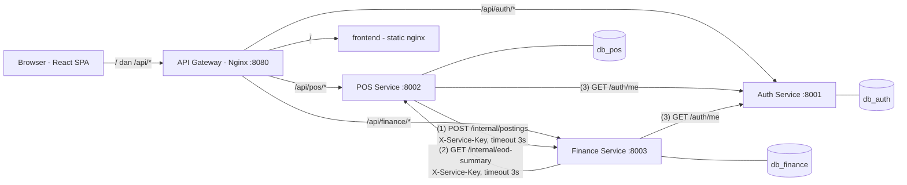

# POS + Finance — Microservice (Laravel 13 + React)

Dua sistem yang terintegrasi: **POS** (shift kasir, transaksi, pembayaran, void) dan **Finance** (posting jurnal
double-entry, rekonsiliasi End of Day). Semua service dibangun dengan **Laravel 13 (PHP 8.4)**, frontend satu SPA **React 19 + Vite**,
database **MySQL 8.4** terpisah per service, dan **Nginx** sebagai API Gateway.


## Menjalankan

Kebutuhan: Docker + Docker Compose v2.

```bash
cp .env.example .env                # isi SEMUA secret (cara generate ada di dalam file)
docker compose up -d --build        # seluruh stack: 3 service + 3 MySQL + frontend + gateway
```

Tidak ada secret di repo. `docker-compose.yml` membaca `APP_KEY_*`, `JWT_SECRET`, `INTERNAL_API_KEY` dan password MySQL
dari `.env` (di-gitignore); compose langsung berhenti dengan error bila ada yang kosong. Jangan pernah commit `.env`.

Buka **http://localhost:8080** (SPA + API). Saat container start, migrasi dan seeder dijalankan otomatis (idempoten).
Port langsung ke service (untuk uji `/internal/*` dengan service key): `8001` auth, `8002` pos, `8003` finance.
Port gateway bisa diganti: `GATEWAY_PORT=9090 docker compose up -d`.

Reset data: `docker compose down -v && docker compose up -d --build`.

### Akun

Superadmin pertama dibuat dari `ADMIN_EMAIL` + `ADMIN_PASSWORD` (min. 12 karakter) di `.env`, hanya bila email itu belum
ada. Setelah login pertama, ganti password lewat UI dan hapus `ADMIN_PASSWORD` dari `.env`. User lain dibuat dari menu Users.

Akun demo `*@demo.test` (satu per role dan outlet, password bersama) **tidak** dibuat secara default. Untuk pengujian
lokal saja, set `SEED_DEMO_USERS=true` di `.env` (dibutuhkan oleh `scripts/e2e-scenarios.sh`). Saat flag kembali
`false`, akun demo yang sudah ada otomatis dinonaktifkan pada start berikutnya. Jangan aktifkan di server yang bisa diakses orang lain.

Seeder produk: `PKT-100K` (100.000), `PKT-50K` (50.000), `PKT-200K` (200.000) untuk skenario S1, beberapa produk lain,
dan `OLD-001` (nonaktif). Outlet: `1 BDG`, `2 GRT`, `3 SKB`, `4 TSM`. Karena rekonsiliasi bersifat satu baris per outlet per hari,
tersedia 4 outlet supaya S1, S2, S3, S5 bisa diuji di hari yang sama.

### Uji skenario otomatis (S1–S5)

```bash
./scripts/e2e-scenarios.sh      # butuh curl + jq, SEED_DEMO_USERS=true, jalankan pada database baru
```

Script ini menjalankan S1 (BDG), S2 (GRT — mematikan container Finance lewat `docker compose stop finance-service`),
S3 (SKB), S4 (posting ganda langsung ke `:8003` dengan `X-Service-Key`), S5 (TSM) serta pengujian auth
(refresh rotation, blacklist logout, user nonaktif) dan nomor transaksi paralel. Hasil terakhir: **96/96 lulus**.

Unit test (kalkulasi transaksi, jurnal, rekonsiliasi):

```bash
cd services/pos && composer install && vendor/bin/phpunit
cd services/finance && composer install && vendor/bin/phpunit
```

## Arsitektur



* Komunikasi antar service **HTTP REST sinkron**, tanpa message broker, timeout 3 detik (`SERVICE_HTTP_TIMEOUT`).
* `/internal/*` hanya menerima header `X-Service-Key` = `INTERNAL_API_KEY` (dibandingkan dengan `hash_equals`) dan **diblokir di gateway**
  (404). Gateway juga menghapus header `X-Service-Key` dari klien.
* Gateway me-resolve DNS upstream saat runtime, jadi service boleh di-stop/start (S2) tanpa restart gateway.
* POS tidak pernah menyentuh `db_finance` dan sebaliknya. Referensi lintas service (`outlet_id`, `shift_id`, `trx_number`, `cashier_id`)
  hanya foreign key logis; snapshot disimpan (`outlet_code`, `sku`, `product_name`, `unit_price`).

### Struktur repo

```
docker-compose.yml
gateway/default.conf.template     # Nginx gateway
scripts/e2e-scenarios.sh          # uji S1–S5
frontend/                         # React SPA (Vite) -> dibuild & disajikan nginx
services/
  auth/      Laravel: JWT (firebase/php-jwt), refresh token, blacklist, RBAC, CRUD user
  pos/       Laravel: outlet, produk, shift, transaksi, sync ke Finance, EOD summary internal
  finance/   Laravel: posting idempoten, jurnal, laporan harian, rekonsiliasi EOD
```

Tiap service: `app/Http/Controllers` (tipis: validasi + response), `app/Services` (logika bisnis), `app/Models`,
`database/migrations` (skema), `database/seeders` (data demo), `.env.example` (semua variabel), `Dockerfile` (FrankenPHP).
Kalkulasi yang kritis dibuat sebagai kelas murni tanpa I/O supaya mudah diuji: `TransactionCalculator`, `JournalBuilder`,
`ReconciliationComparator`. Semua uang memakai `DECIMAL(15,2)` di DB dan string + `bcmath` di PHP (`App\Support\Money`), tidak ada float.

### Auth

* Login → access token (15 menit) + refresh token (7 hari), HS256. Setiap token punya `jti`.
* Refresh **merotasi** token: refresh token lama langsung masuk `token_blacklist`.
* Logout mem-blacklist refresh token (dan access token yang sedang dipakai).
* `GET /auth/me` memvalidasi signature, tipe, blacklist, **dan status user di DB** → user nonaktif / token dicabut langsung ditolak di
  semua service, karena POS & Finance memvalidasi setiap request ke endpoint ini (bukan hanya mengecek signature lokal).
* Login dibatasi 10 percobaan/menit per email + IP klien.

### Aturan POS yang penting

* Harga selalu dari tabel `products`; klien hanya mengirim `product_id` + `quantity`.
* `tax = ROUND((subtotal − diskon) × TAX_RATE, 2)`, half-up seperti `ROUND()` MySQL.
* **Nomor transaksi aman konkuren**: `INSERT … ON DUPLICATE KEY UPDATE last_number = LAST_INSERT_ID(last_number + 1)` pada tabel
  `trx_sequences (outlet_id, business_date)` di dalam transaksi DB (row terkunci sampai commit) + `UNIQUE(trx_number)`. Diuji dengan 10 request paralel.
* **Satu shift open per kasir** dijamin di level DB: kolom generated `open_cashier_guard = IF(status='open', cashier_id, NULL)` dengan UNIQUE index.
* Isolasi data: kasir → miliknya, supervisor_pos → outletnya, superadmin → semua. Data di luar scope dijawab 404.
* `business_date` selalu Asia/Jakarta (timezone aplikasi & sesi MySQL `+07:00`).

## Penanganan kegagalan sinkronisasi POS → Finance

1. **Pembayaran/void di-commit dulu**, baru event dikirim ke Finance *di luar* transaksi DB. Jadi kegagalan Finance tidak pernah
   menggagalkan pembayaran; tidak ada HTTP call yang menahan lock DB.
2. Sebelum kirim, `finance_sync_status = pending`. Hasilnya: `synced` (201 atau 200 duplikat) atau `failed` dengan alasan di
   `finance_last_error` (timeout/koneksi ditolak/penolakan 4xx). Semua error ditangkap di `FinanceClient`; tidak ada 500.
3. **Idempotensi**: setiap event punya `idempotency_key` = `{trx_number}:sale` / `{trx_number}:reversal`, UNIQUE di `postings`.
   Duplikat → 200 tanpa jurnal baru (juga aman untuk request duplikat yang benar-benar bersamaan, lewat penanganan error unique key).
   Karena itu mengirim ulang **selalu aman**, termasuk ketika timeout terjadi setelah Finance sebenarnya sudah menyimpan.
4. Transaksi void selalu mengirim `sale` lalu `reversal`. Jika sale dulu gagal terkirim, resync memperbaikinya dalam urutan yang benar
   (Finance menolak reversal tanpa sale dengan 422).
5. **Resync**: tombol / `POST /transactions/{id}/resync-finance` (kasir, supervisor). **Tutup shift** mencoba kirim ulang semua transaksi yang
   belum synced sekali (berhenti di kegagalan koneksi pertama agar tidak menunggu N × timeout), lalu tetap menutup shift dan
   mengembalikan `unsynced_count` sebagai peringatan.
6. `unsynced_count` menghitung transaksi yang kekurangan event-nya **mengubah ledger** (paid tanpa sale di Finance, atau void yang sale-nya
   sudah masuk tapi reversal belum). Void yang sale-nya belum pernah sampai berdampak nol terhadap ledger; tetap berstatus `failed`
   dan tetap dikirim ulang lengkap untuk jejak audit (`unsynced_total` menghitung semuanya). Karena itu S2 menghasilkan
   `unsynced_count = 1` (T2).
7. **Rekonsiliasi EOD** menjadi jaring pengaman: Finance membandingkan ringkasan POS dengan ledger sendiri. Selisih muncul sebagai
   `AMOUNT_DIFF` / `COUNT_DIFF` (+ petunjuk `UNSYNCED_TRANSACTIONS`). Setelah resync, rekonsiliasi dijalankan ulang pada **baris yang sama**
   hingga `matched`; selisih yang memang nyata (mis. `CASH_VARIANCE`) diselesaikan manager_finance dengan catatan wajib → `resolved` (final).

## API ringkas (via gateway `/api`)

| Service | Endpoint |
|---|---|
| Auth `/api/auth` | `POST login`, `POST refresh`, `POST logout`, `GET me`, `GET/POST users`, `GET/PUT users/{id}`, `DELETE users/{id}` (nonaktifkan), `POST users/{id}/activate` |
| POS `/api/pos` | `GET outlets`, CRUD `products` (DELETE = nonaktifkan), `POST shifts/open`, `GET shifts/current`, `GET shifts/{id}/summary`, `POST shifts/{id}/close`, `GET/POST transactions`, `GET transactions/{id}`, `POST transactions/{id}/pay`, `POST transactions/{id}/void`, `POST transactions/{id}/resync-finance`, `GET dashboard` |
| Finance `/api/finance` | `GET postings`, `GET postings/{id}`, `GET reports/daily-sales`, `POST reconciliations/run`, `GET reconciliations`, `GET reconciliations/{id}`, `PATCH reconciliations/{id}/resolve`, `GET accounts` |
| Internal (tanpa gateway) | POS `GET /internal/eod-summary`, Finance `POST /internal/postings` |

Format respons: sukses `{"data": …, "meta": {page, per_page, total, last_page}}`, error `{"error": {"code", "message", "details"}}`.

## Frontend

React Context untuk auth global; route guard per role (menu dan halaman), auto-refresh access token 60 detik sebelum kedaluwarsa
(dan satu kali retry transparan saat 401). 401 → halaman login, 403 → halaman forbidden, 409/422 → pesan bisnis dari API
(+ error per field), 5xx/koneksi → pesan error. Nominal dalam format Rupiah; tombol aksi tampil sesuai status dan role.
Development: `cd frontend && npm install && npm run dev` (proxy `/api` ke `localhost:8080`).

## Go vs Laravel — apa yang berbeda

Versi awal (repo `pos-finance-microservices`) memakai Go: `net/http` standar, `database/sql` + SQL manual, `shopspring/decimal`, `golang-jwt`,
dan paket internal `pkg/httpx`, `pkg/authn`, `pkg/timex`. Versi ini memenuhi spesifikasi yang sama dengan Laravel. Perbedaannya:

| Aspek | Go (versi awal) | Laravel (repo ini) |
|---|---|---|
| Boilerplate | Router, JSON decode/encode, validasi, paginasi, error envelope ditulis sendiri (`pkg/httpx`) | Tersedia dari framework: routing, `$request->validate()`, `paginate()`, exception handler; kode fokus ke aturan bisnis |
| Validasi input | Manual per field (`ValidationError`) | Rule deklaratif (`required`, `in:`, `date_format`, `unique`…), 422 otomatis |
| Akses DB | SQL manual + `Scan` ke struct, helper `WithTx` sendiri | Eloquent + Query Builder, `DB::transaction()`, `lockForUpdate()`, migration & seeder bawaan |
| Skema DB | File `.sql` / migrasi manual | `php artisan migrate` + seeder idempoten dijalankan otomatis saat container start |
| Uang | `shopspring/decimal` (tipe khusus) | String desimal + `bcmath` (`App\Support\Money`), cast `decimal:2` di model |
| Tanggal/zona waktu | Tipe `timex.Date` custom + `time/tzdata` | Carbon + `config('app.timezone') = Asia/Jakarta` + sesi MySQL `+07:00` |
| Middleware auth | `http.Handler` custom + context value | Middleware alias (`jwt`, `role:…`, `service.key`), dijalankan sebelum route-model binding |
| HTTP antar service | `http.Client{Timeout}` | `Http::timeout(3)` (Guzzle), exception koneksi ditangkap → status `failed` |
| Runtime / image | Satu binary statis (~15 MB), start instan, memori sangat kecil | PHP 8.4 di FrankenPHP (Caddy + PHP multi-thread), image ~240 MB, butuh `composer install` saat build |
| Performa & konkurensi | Goroutine, throughput tinggi, latensi rendah | Cukup untuk beban POS outlet; model request-per-thread. Bisa ditingkatkan dengan Octane/worker mode |
| Tipe & kesalahan | Dicek compiler | Dinamis; diimbangi type hint PHP 8, `readonly`, unit test, dan Pint |
| Testing | `go test` | PHPUnit (unit test kalkulasi/jurnal/rekonsiliasi) + script E2E |
| Kecepatan pengembangan | Lebih banyak kode per fitur | Lebih sedikit kode, konvensi jelas, familiar bagi tim PHP |

Yang **tidak** berubah: kontrak API, skema tabel, aturan bisnis, cara menangani kegagalan sinkronisasi, dan frontend.
Karena kontraknya sama, service Go dan Laravel bisa dicampur per service (diizinkan soal) — misalnya Auth tetap Go dan POS/Finance Laravel —
selama `JWT` diverifikasi lewat `GET /auth/me` dan format error `{"error": {...}}` dipertahankan.

Ringkasnya: Go unggul di efisiensi runtime dan ukuran image; Laravel unggul di produktivitas (validasi, ORM, migrasi, seeder,
exception handling siap pakai) sehingga logika bisnis lebih ringkas dan mudah dibaca.
